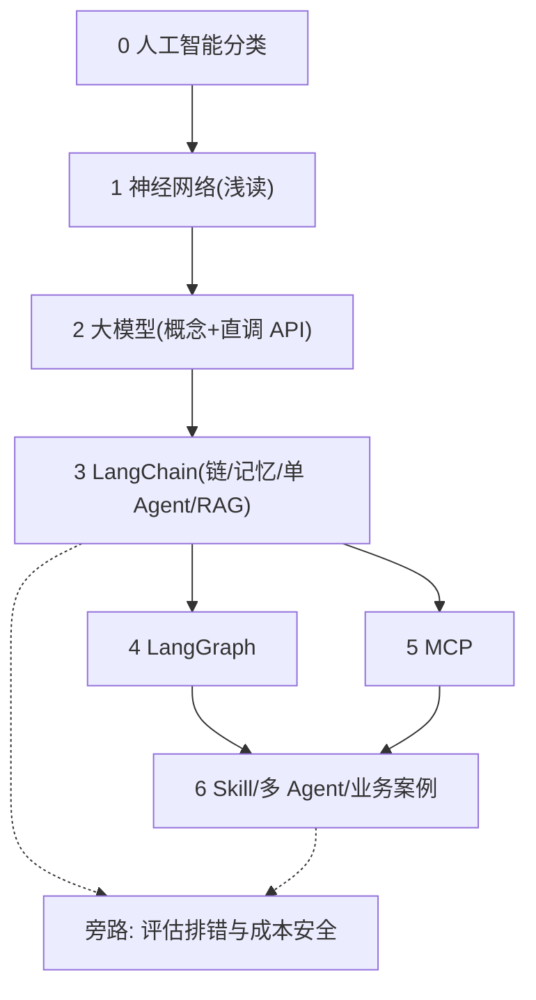

# 学习路线

本系列以**应用 AI** 为主线：先建立必要概念，再快速进入 LLM、工具链与 Agent 落地。理论够用即可，重点练「能用、会接、能排错」。

<!-- more -->

## 1. 目标定位

面向有前后端基础的开发者，目标不是系统啃完机器学习教材，而是能：

- 说清 AI / 机器学习 / 深度学习 / LLM 的边界
- 会直调大模型 API（含流式、结构化输出），再谈编排
- 用 LangChain / LangGraph 搭工作流与 Agent
- 接入 MCP、Skill 等工具能力，落到真实业务，并会基本排错与控成本

---

## 2. 建议学习顺序

| 阶段 | 内容 | 说明 | 状态 |
|------|------|------|------|
| **0. 地图** | [人工智能分类](/pages/ai-classification/) | 三大流派、NLP/语音/CV、知识工程 vs 机器学习 | 已有 |
| **1. 底座** | [神经网络](/pages/ai-neural-network/) | 神经元、前向/反向、过拟合；**浅读即可**（抓引言～泛化 + 思维导图），不必抠框架与存盘细节 | 已有 |
| **2. 大模型** | [大模型](/pages/ai-llm/) | Token、上下文、温度、提示词、RAG 直觉；**并会直调 API**（messages / 流式 / 结构化输出） | 已有 |
| **3. 编排** | [大编排](/pages/ai-langchain/) | LangChain：链、记忆、**单 Agent + 工具**、RAG（含 Embedding / 向量库） | 已有 |
| **4. 工作流** | LangGraph | 状态图、分支、循环、人机协同（复杂控制流） | 待写 |
| **5. 工具协议** | MCP | 模型与外部工具/数据源的标准接入；可与阶段 4 **并行**，不必等图写完再碰 | 待写 |
| **6. 落地** | Skill / 多 Agent / 案例 | 可复用技能、多智能体协作与业务案例；与阶段 3「单 Agent」分工见下 | 待写 |

**旁路（贯穿，不必单独成「主阶段」）**：评估与排错（日志 / 追踪 / 黄金集）、密钥与限流、Token 成本、提示注入与敏感数据。

**Agent 边界（避免重复感）**：

- 阶段 3：流程固定用链；需动态选工具时用**单 Agent**（如 ReAct）即可。
- 阶段 6：多 Agent 分工、Skill 封装、端到端业务案例与上线注意点。

> **原则**：阶段 0–2 快速过；阶段 3 起以**一个小项目**驱动（如文档问答、客服助手），边做边叠 LangGraph / MCP / Skill。

---

## 3. 路线示意

---

## 4. 现阶段怎么学

1. 先读 [人工智能分类](/pages/ai-classification/)，建立全局坐标。
2. 再读 [神经网络](/pages/ai-neural-network/)：抓住「前向算预测、反向调参数、过拟合」即可；后面框架与存盘可当附录跳过。
3. 再读 [大模型](/pages/ai-llm/)：掌握 Token、上下文、温度、提示词与 RAG 直觉；同步用任意兼容 API **亲手打通**一轮对话与结构化输出。
4. 再读 [大编排](/pages/ai-langchain/)：用 LangChain 把链、记忆、工具与 RAG（Embedding / 向量库）串成流水线；先验证检索质量，再谈换更大模型。
5. 选一个小场景贯穿后续：控制流复杂上 **LangGraph**；要标准接工具/数据上 **MCP**（二者可并行）；最后用 **Skill / 多 Agent** 收成可复用能力，并顺带练排错与成本控制。

后续章节会按上表补齐；本页作目录索引持续更新。
