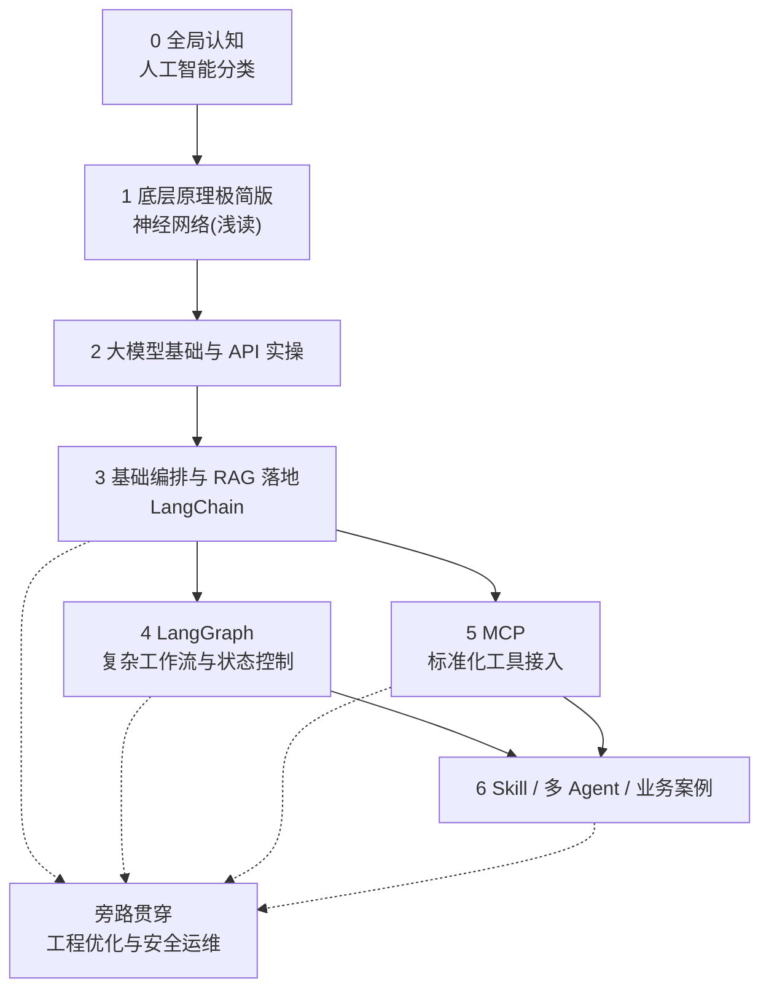

# 学习路线

本系列以**落地应用 AI 开发**为核心主线：弱化晦涩理论堆砌，强化「概念认知 → 工具实操 → 工程编排 → 业务落地 → 问题优化」全链路。坚持理论够用、实操为主、落地为王，适配有前后端基础的开发者，快速具备 AI 应用、Agent 项目开发与线上运维能力。

<!-- more -->

## 1. 核心目标定位

面向有前后端开发基础的开发者，摒弃传统机器学习教材式啃书模式，聚焦工程落地，最终实现五大核心能力：

- 清晰区分人工智能 / 机器学习 / 深度学习 / LLM 大模型的核心边界与应用场景
- 熟练调用各类大模型 API，掌握普通对话、流式输出、结构化输出三大核心能力
- 精通 LangChain、LangGraph 工具链，可独立搭建 AI 工作流、单 / 多 Agent 智能体
- 掌握 RAG 检索增强全流程，熟练接入向量库、优化检索精度，实现知识库问答落地
- 掌握工具协议、技能封装、项目排错、成本管控、安全防护，适配真实业务上线

---

## 2. 优化后学习顺序（由浅入深、层层递进）

**优化原则**：前置基础认知、合并重复模块、区分必学 / 选学、绑定实操项目、贯穿工程规范；解决原路线部分模块并行混乱、实操指引缺失、重点不清晰的问题。

| 阶段 | 核心学习内容 | 学习重点与实操要求 | 学习属性 | 状态 |
|------|--------------|--------------------|----------|------|
| **0. 全局认知** | [人工智能分类](/pages/ai-classification/) | 搭建 AI 全局框架，分清三大技术流派、CV / NLP / 语音核心场景、传统算法与大模型的区别，建立学习坐标系，不深究细节 | 必学（打底） | 已有 |
| **1. 底层核心原理（极简版）** | [神经网络](/pages/ai-neural-network/) | 仅掌握核心刚需：神经元机制、前向传播、反向传播、激活函数、过拟合 / 泛化；跳过底层框架训练、模型存盘等冗余细节，满足大模型原理理解即可 | 必学（浅读） | 已有 |
| **2. 大模型基础与 API 实操** | [大模型](/pages/ai-llm/) | 核心概念：Token、上下文窗口、温度值、top-p、提示词工程、大模型优缺点；硬性实操：亲手打通 OpenAI / 兼容模型 API，实现普通对话、流式输出、JSON 结构化输出，掌握基础参数调优 | 必学（重实操） | 已有 |
| **3. 基础编排与 RAG 落地** | [大编排](/pages/ai-langchain/) | 掌握 LangChain 核心：提示词模板、上下文记忆、链式调用、工具调用；落地核心：Embedding 向量嵌入、向量库使用、RAG 完整流水线、检索精度调优；实操：完成首个极简项目（文档知识库问答） | 必学（核心阶段） | 已有 |
| **4. 复杂工作流与状态控制** | LangGraph | 解决 LangChain 固定流程短板，掌握状态管理、分支判断、循环调度、人机协同、断点续跑；适配复杂 AI 业务流程，迭代优化已有 RAG 问答项目 | 必学（进阶核心） | 待写 |
| **5. 标准化工具接入能力** | MCP 工具协议 | 掌握大模型与外部工具、数据库、业务接口的标准化接入方案；统一工具调用规范，解决多工具适配混乱问题，可与阶段 4 **并行**学习 | 必学（工程必备） | 待写 |
| **6. 高阶落地与工程化** | Skill 封装 / 多 Agent 协作 / 业务实战案例 | 封装可复用 AI 技能模块、搭建多智能体分工协作架构、落地真实业务场景（智能客服、自动化办公、数据分析助手等） | 必学（落地收尾） | 待写 |
| **旁路贯穿（全周期）** | 工程优化与安全运维 | 全程贯穿所有阶段，无需单独脱产学习：日志追踪、问题排错、黄金集评估、密钥管理、接口限流、Token 成本管控、提示注入防护、敏感数据脱敏 | 贯穿必学 | 待补充 |

### Agent 能力边界（规避学习重复）

- **阶段 3 基础 Agent**：适配简单场景，固定流程用链式调用，动态工具选择用单 Agent（ReAct 架构），完成基础问答、工具调用
- **阶段 6 高阶 Agent**：适配复杂业务，实现 Skill 复用、多 Agent 分工协作、流程解耦、线上稳定落地，具备工程化迭代能力

> **核心学习原则**：0–2 阶段快速通关、建立认知；3 阶段起以「文档智能问答」为贯穿项目，依次叠加 RAG 优化、LangGraph 复杂流程、MCP 工具接入、Skill 封装、多 Agent 迭代，边实操边学习，杜绝纸上谈兵。

---

## 3. 优化后学习路线流程图

---

## 4. 标准化学习步骤（可直接照做）

1. **搭建全局认知**：阅读 [人工智能分类](/pages/ai-classification/)，区分 AI 各细分领域，明确主攻方向（LLM 应用开发），排除无关技术干扰。
2. **吃透底层刚需原理**：阅读 [神经网络](/pages/ai-neural-network/)，仅记忆核心机制，跳过模型训练、框架源码、参数保存等非应用层内容，做到「懂原理、不用造轮子」。
3. **掌握大模型基础实操**：熟记核心参数与提示词技巧；手动编码实现 API 基础调用、流式对话、结构化输出，积累基础调用模板。见 [大模型](/pages/ai-llm/)。
4. **完成首个 AI 项目落地**：基于 LangChain 搭建完整 RAG 知识库项目，完成文档解析、向量嵌入、检索问答、记忆上下文，保证项目可正常运行。见 [大编排](/pages/ai-langchain/)。
5. **迭代项目复杂度**：并行学习 LangGraph 与 MCP，为现有 RAG 项目添加分支判断、循环流程、外部工具调用（搜索、接口查询），优化项目灵活性。
6. **工程化收尾落地**：封装通用 Skill，改造为多 Agent 协作架构，适配真实业务场景；同时补齐日志、排错、限流、成本优化、安全防护等线上能力。
7. **全程贯穿**：每完成一个模块实操，同步记录问题与优化方案，建立个人 AI 开发知识库，形成可复用经验。

---

## 5. 选学拓展模块（不干扰主线）

学完核心路线后可按需进阶，不强制主线进度：

- **模型微调基础**：LoRA 轻量化微调、数据集制作（适合需要定制化模型的场景）
- **向量库深度优化**：索引策略、分片存储、高并发检索优化
- **Agent 高级架构**：AutoGen 多智能体、任务拆解与自主决策

---

本文档为持续更新的 AI 学习目录索引；后续将按优化后的阶段顺序补齐所有待写章节，并持续迭代实操案例与工程最佳实践。
