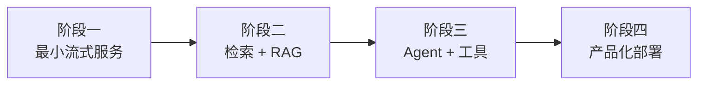
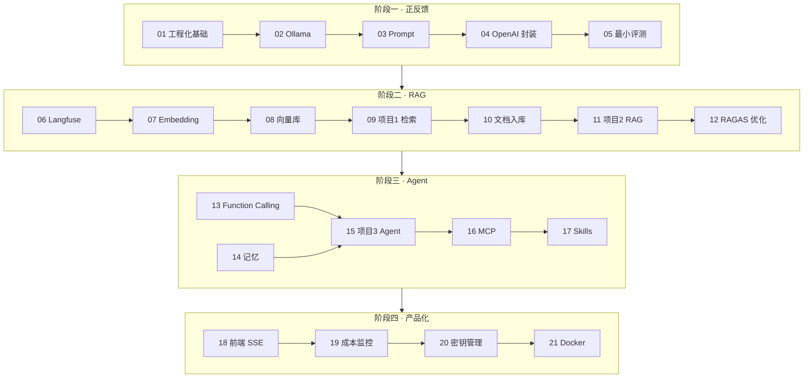

# AI 应用工程化学习路线（最终版目录）

承接 [AI 应用开发基础](/pages/ai-roadmap/)：概念与单能力已通关后，本专栏以**可交付工程**为主线——跑通模型 → 检索与 RAG → Agent 与工具 → 产品化部署。共 **21 篇**，约 **11 周**跑完全线。

<!-- more -->

## 1. 核心目标

面向有前后端基础、已完成「基础」专栏的开发者，最终具备：

- 交付可流式对话、可回归测试的最小 LLM 服务
- 独立完成纯检索服务与带引用溯源的完整 RAG
- 实现可调用工具、有记忆、能防护注入的 Agent
- 用 docker-compose 一键起全家桶，并具备可观测与成本意识

---

## 2. 四阶段总览

| 阶段 | 主题 | 建议节奏 | 产出物 |
|------|------|----------|--------|
| **一** | 跑通第一个模型（正反馈） | 2 周 | 能流式对话、可回归测试的最小服务 |
| **二** | 检索与 RAG（项目 1 + 2） | 4 周 | 纯检索服务 + 带引用溯源的完整 RAG |
| **三** | Agent 与工具（项目 3） | 3 周 | 可调用工具、有记忆、能防护注入的 Agent |
| **四** | 产品化与部署 | 2 周 | docker-compose 一键起全家桶 + 可观测 + 前端联调 |

> **原则**：每阶段产出物可演示后再进入下一阶段。目录优化到此为止，收益已低于动手收益。

---

## 3. 完整目录（21 篇）

### 阶段一：跑通第一个模型（正反馈）

**产出物**：一个能流式对话、可回归测试的最小服务

| 篇 | 主题 | 学什么 |
|----|------|--------|
| **01** | Python 工程化基础 | venv/uv、FastAPI、异步基础（asyncio 并发）、.env 配置 |
| **02** | Ollama 本地模型跑通 | 本地聊天 + 流式输出 |
| **03** | Prompt 工程与输出控制 | 系统提示 / Few-shot / CoT / 结构化输出 / Token 计数 |
| **04** | OpenAI 兼容接口与调用封装 | openai SDK、重试 / 限流、成本控制 |
| **05** | 最小评测意识 | 手写 10 条 case 跑回归，为后续 RAGAS 埋点 |

### 阶段二：检索与 RAG（项目 1 + 2）

**产出物**：纯检索服务 + 带引用溯源的完整 RAG

| 篇 | 主题 | 学什么 |
|----|------|--------|
| **06** | 可观测性接入 | 【前移】Langfuse 接入、trace 埋点（成本监控部分留在阶段四） |
| **07** | Embedding 与文本向量化 | bge-m3、切分策略、chunk metadata（页码 / 标题路径） |
| **08** | 向量数据库 | Chroma 入门，Qdrant / FAISS 按需了解 |
| **09** | 语义搜索 | **项目 1**：纯检索服务（`asyncio.gather` 并发检索在此实战） |
| **10** | 文档解析与知识库入库 | PDF / Word 解析、清洗、入库管线 |
| **11** | RAG 完整实战 | **项目 2**：混合检索 + 重排 + 引用溯源 |
| **12** | RAG 评估与优化 | RAGAS、badcase 分析、语义缓存 |

### 阶段三：Agent 与工具（项目 3）

**产出物**：一个可调用工具、有记忆、能防护注入的 Agent

> **说明**：MCP 是「接工具 / 数据」，Skills 是「打包能力」，粒度不同，别混学。

| 篇 | 主题 | 学什么 |
|----|------|--------|
| **13** | Function Calling 与工具使用 | 工具定义、参数解析、错误处理 |
| **14** | 记忆与多轮对话 | 对话状态、短期 / 长期记忆 |
| **15** | Agent 实战 | **项目 3**：ReAct / LangGraph、Prompt 注入防护（13+14 在此汇合） |
| **16** | MCP 协议 | 工具 / 数据的标准化接入 |
| **17** | Agent Skills 能力打包 | SKILL.md、渐进式披露、按需加载 |

### 阶段四：产品化与部署

**产出物**：docker-compose 一键起全家桶 + 可观测 + 前端联调

| 篇 | 主题 | 学什么 |
|----|------|--------|
| **18** | 前端界面（React + TS） | Vite、SSE 流式、与 FastAPI 同仓库（先原生 EventSource，不早引入状态管理） |
| **19** | 成本与用量监控 | 【拆分后】token 用量、成本分摊、告警 |
| **20** | 配置与密钥管理 | .env / secrets 分层，Docker 化前必做 |
| **21** | 部署与 Docker 化 | docker-compose 一键起全家桶 |

---

## 4. 全局约定（每篇笔记固定小节）

| 固定小节 | 要求 |
|----------|------|
| **可运行代码** | 每篇配 `code/` 目录，最小可跑项目；**跑通再记笔记** |
| **失败模式速查表** | 记录踩过的坑；三个月后往往比正文更有价值 |
| **回归 case** | 项目类笔记（**09 / 11 / 15**）末尾附当前评测 case 列表 |

---

## 5. 执行纪律

1. **阶段二结束前只用命令行交互**，禁止为 RAG 提前加界面（不打断检索主线）。
2. **每阶段产出物可演示后再进入下一阶段**；目录已定，优先动手。
3. 建议节奏：**阶段一 2 周 → 阶段二 4 周 → 阶段三 3 周 → 阶段四 2 周**，约 **11 周**跑完全线。

---

## 6. 与「基础」专栏的衔接

| 基础专栏已覆盖 | 本专栏怎么接 |
|----------------|--------------|
| Prompt / RAG / Agent 概念 | 03、11、15 升到可回归、可演示工程 |
| LLM API 直觉 | 02、04 固化为本地 + 兼容接口封装 |
| 编排框架扫读 | 15 用 LangGraph 做真实 Agent 项目 |

前置入口：[AI 导论与学习路线](/pages/ai-roadmap/)

---

本文档为「AI应用开发技术」专栏目录索引；21 篇按上表推进，阶段产出可演示后再迭代下一阶段。
