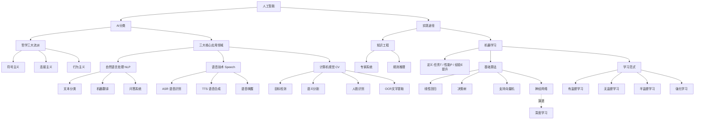

# 人工智能分类
从哲学三大流派、核心应用领域（NLP / 语音 / CV）到知识工程与机器学习两条实现路径，建立人工智能全局框架。

本篇对应 [学习路线](/pages/ai-roadmap/) 阶段 0：建立全局坐标后，进入 [神经网络](/pages/ai-neural-network/)。
<!-- more -->

## 1. 引言
人工智能（Artificial Intelligence, AI）是研究让机器具备感知、理解、推理、学习、决策与行动能力的学科，目标是模拟、延伸和扩展人类智能。

本文从两个维度梳理：
- **AI 分类**：哲学三大思想流派；现实业务要解决的应用领域（NLP/语音/CV）
- **实现途径**：两大路线 —— 知识工程、机器学习

> 面向本系列读者：我们定位是**AI应用开发**，不做底层模型训练；这里重在建立概念地图，分清各个名词边界，不必死记算法细节。

---

## 2. AI 分类
### 2.1 哲学三大流派
人工智能发展历史上三条技术思想路线，现代系统通常会互相融合。

#### 2.1.1 符号主义（Symbolism）
- **核心**：智能本质是符号操作与逻辑推理；知识用符号表达，依靠规则做推演。
- **典型**：专家系统、规则引擎、知识图谱、逻辑编程。
- **代表系统**：MYCIN医疗诊断专家系统、Cyc常识知识库。
- ✅优点：可解释性极强，推理链路透明，适合知识密集业务。
- ❌缺点：难以处理模糊、不确定信息；高度依赖人工编写规则与知识库，扩张成本高，无法自动从原始数据学特征。

#### 2.1.2 连接主义（Connectionism）
- **核心**：模仿人脑神经元网络，依靠大量节点连接、权重迭代来习得智能。
- **典型**：人工神经网络、深度学习、反向传播。
- **代表模型**：MLP、CNN、RNN、LSTM、Transformer、GAN。
- ✅优点：可以从原始数据自动提取特征；大数据下效果爆炸，是现在大模型的底层根基。
- ❌缺点：黑盒属性，可解释差；依赖大量数据与算力；训练容易不稳定。

> 💡我们做的LLM、Agent，底层就是**连接主义**；同时经常会叠加符号主义的规则、知识图谱做增强。

#### 2.1.3 行为主义（Behaviorism）
- **核心**：智能来自智能体与环境交互，依靠「感知‑动作‑反馈」闭环适应外界。
- **典型**：强化学习、进化算法、机器人控制。
- **代表算法**：Q‑Learning、DQN、PPO、A3C。
- ✅优点：擅长序列决策、动态环境控制；不需要海量标注样本。
- ❌缺点：训练周期长；奖励函数很难设计；复杂真实环境泛化有限。

---

### 2.2 三大核心应用领域
现实工程主要划分：自然语言处理 NLP、语音 Speech、计算机视觉 CV。

#### 2.2.1 自然语言处理（NLP）
让机器理解、生成人类语言，**大模型 / Agent 主要工作域**。

| 子任务 | 说明 | 典型应用 |
|--------|------|----------|
| **文本分类** | 将文本归入预定义类别 | 垃圾邮件识别、情感分析、内容风控 |
| **机器翻译** | 跨语言文本转换 | DeepL、翻译服务 |
| **问答系统** | 基于文档/知识库给出答案 | 智能客服、RAG知识库问答、聊天助手 |

其它子任务：命名实体识别NER、文本摘要、句法分析。
> 当前主流：BERT、GPT系列等Transformer预训练模型。

#### 2.2.2 语音技术（Speech）
语音信号和文本互相转换。

| 子任务 | 说明 | 典型应用 |
|--------|------|----------|
| **ASR 语音识别** | 语音转文字 | 会议转写、语音输入、字幕生成 |
| **TTS 语音合成** | 文字生成语音 | 有声读物、播报、对话语音输出 |
| **语音唤醒** | 检测唤醒词激活设备 | 智能音箱唤醒 |

#### 2.2.3 计算机视觉（CV）
让机器理解图像、视频信息。

| 子任务 | 说明 | 典型应用 |
|--------|------|----------|
| **目标检测** | 定位+识别图中物体 | 安防、工业质检 |
| **语义分割** | 逐像素做类别标记 | 自动驾驶、医学影像 |
| **人脸识别** | 人脸身份校验识别 | 设备解锁、门禁 |
| **OCR文字提取** | 图片中识别文字 | 票据、证件识别 |

主流技术：CNN、YOLO、U‑Net、Vision‑Transformer(ViT)。

---

## 3. 两大实现途径
### 3.1 知识工程
早期AI方案，把人类专家知识显式编码成规则、事实，依靠推理引擎运行。
- 核心公式：`知识 = 概念 + 规则 + 推理`
- 代表：专家系统、规则诊断系统。
- ✅优点：不需要训练数据，逻辑透明。
- ❌局限：知识录入成本巨大；很难处理模糊场景；维护迭代麻烦，泛化弱。

> 在现代AI中一般不作为主引擎，常用来做**辅助约束**：例如Agent里加业务规则、接入知识图谱。

### 3.2 机器学习
现在AI主流实现路径。
> Tom Mitchell 经典定义：
> 对于任务T、性能度量P，如果程序在T上的性能P，随着经验E增加而提升，则称程序从E中学习。

核心思想：**不是手写一条条业务规则，而是设计训练流程，让机器从数据中自动学到规律**。

#### 3.2.1 基础算法概览
| 算法 | 说明 | 适用场景 |
|------|------|----------|
| **线性回归** | 拟合输入输出线性关系 | 数值预测 |
| **决策树** | 树形特征划分做决策 | 风险、分类；可解释好 |
| **SVM** | 最大间隔超平面分类 | 小样本高维数据 |
| **神经网络** | 多层神经元，反向传播更新参数 | 通用拟合；堆叠多层成为深度学习 |

> **深度学习**：多层隐藏层神经网络，自动学习多层特征；代表：CNN、RNN/LSTM、Transformer、GAN。

#### 3.2.2 四种学习范式
| 范式 | 描述 | 数据条件 | 代表 |
|---|---|---|---|
| **有监督学习** | 使用标注好的输入输出样本训练 | 大量标注 | 图像分类、文本分类 |
| **无监督学习** | 从无标注数据挖掘内在结构 | 无标签 | K‑means聚类、异常检测 |
| **半监督学习** | 少量标注 + 大量无标注混合训练 | 少量标签 | 标注昂贵场景如医疗影像 |
| **强化学习** | 智能体交互环境，依靠奖励信号优化策略 | 交互经验 | 游戏AI、机器人、部分大模型对齐RLHF |

---

## 4. 知识工程 vs 机器学习对比
| 维度 | 知识工程 | 机器学习 |
|---|---|---|
| 知识来源 | 人类专家编写 | 数据 |
| 核心手段 | 规则、逻辑推理 | 统计模型、神经网络 |
| 可解释性 | 高 | 深度学习偏低 |
| 数据依赖 | 低 | 高 |
| 泛化能力 | 弱 | 强 |

> 现代AI经常二者结合：大模型(机器学习) + 业务规则/知识图谱(符号知识)，取长补短。

## 5. 各领域技术演进小结
1. **NLP**：规则统计时代 → 深度学习 → Transformer预训练大模型（当前主流）
2. **语音**：GMM‑HMM → 端到端深度学习、Transformer语音模型
3. **CV**：传统图像处理 → CNN → ViT多模态
4. **强化学习**：传统强化学习 → 深度强化学习；用于机器人、游戏、大模型RLHF对齐。

> 三大流派不是互斥。例：自动驾驶 = 深度学习做感知 + 符号规则约束交通逻辑 + 强化学习做决策调优。

## 6. 总结
- AI可以从**思想流派**、**业务领域(NLP/CV/语音)**、**实现路径(知识工程/机器学习)**三个角度建立认知。
- 当前工业主流：机器学习，尤其是深度学习/Transformer。
- 对本系列：我们做**LLM应用开发**，重点关注NLP领域；理解连接主义基础，同时懂得什么时候引入符号规则做约束即可，不必深挖底层训练。

下一步：按 [学习路线](/pages/ai-roadmap/)  [神经网络](/pages/ai-neural-network/)，之后进入大模型概念与API实操。

---

## 附录：整体结构

