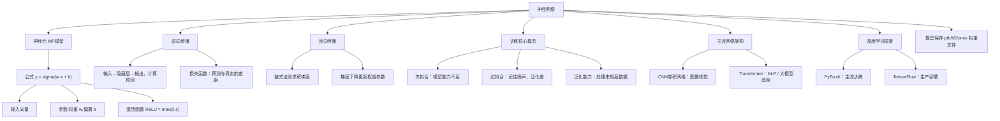

# 神经网络
从神经元MP模型、前向/反向传播到欠拟合与过拟合，梳理神经网络基础概念与主流架构。

神经网络本质：**输入 → 多层可学习变换 → 输出** 的可训练计算图。依靠数据迭代优化参数；激活函数引入非线性，使其可以拟合现实世界复杂映射；深度学习就是层数更深、规模更大的神经网络。

本篇对应 [学习路线](/pages/ai-roadmap/) 阶段 1：**面向AI应用开发者，读懂即可，不需要掌握模型训练实现**。
<!-- more -->

## 1. 引言
神经网络（Neural Network, NN）是机器学习**连接主义**的核心模型。大量简单神经元分层互联，通过调整连接权重，从数据自动学习输入到输出的映射关系。
深度学习建立在深层神经网络之上，是图像、语音、NLP大模型的底层基础。

### 1.1 阅读指引（严格对齐学习路线）
| 阅读模式 | 阅读范围 | 学习目标 |
|---|---|---|
| **浅读（本系列推荐）** | §1～§7 + §11思维导图；§8架构快速扫读 | 听懂名词：神经元、前向传播、反向传播、损失、过拟合、Transformer；理解大模型底层原理即可 |
| **选读（仅训练模型时看）** | §9 深度学习框架、§10 模型存盘加载 | 自己动手训练模型、解析权重文件再回看，做LLM‑Agent应用开发可以直接跳过 |

> 读完本章，跳转 [大模型](/pages/ai-llm/)。我们做应用开发，**不需要手写反向传播、不需要手动调参训练网络**，理解原理用来读懂大模型的边界与局限性。

### 1.2 要解决的问题
监督学习任务可以抽象：给定样本 \((x,y)\)，学习映射函数 \(f\)，让预测 \(\hat y=f(x)\) 尽可能接近真实值 \(y\)。

面对高维、非线性的复杂任务，人工设计特征与规则成本极高。神经网络依靠多层可微分结构，自动学习数据特征，通过梯度优化完成拟合。

### 1.3 核心直觉（三句话记住）
1. **单元简单，组合强大**：单个神经元只做加权求和；多层堆叠之后可以拟合任意复杂函数。
2. **前向算预测，反向改参数**：前向传播算出预测结果与损失；反向传播依靠链式法则求梯度，梯度下降更新权重、偏置。
3. **追求泛化，不是死记训练数据**：欠拟合代表模型能力不足；过拟合代表模型记住训练集噪声；目标是对从未见过的数据也输出正确结果。

### 1.4 文章结构
行文顺序：神经元单元 → 前向传播 → 损失函数 → 梯度下降 → 反向传播 → 训练与泛化 → 网络架构、框架附录。
> §7为分界线：前面是应用开发者必懂概念；后面为附录，按需查阅。

---

## 2. 神经元与MP模型
神经元是神经网络最小计算单元，**多输入，单输出**。经典为MP（McCulloch‑Pitts）模型：
\[
y = \sigma(w_1x_1 + w_2x_2 + \dots + w_nx_n + b)
\]

- 输入向量 \([x_1,x_2,\dots,x_n]\)：原始输入信息
- 权重 \(w\)：每个输入的重要程度，**可学习参数**，训练过程不断变化
- 偏置 \(b\)：神经元激活阈值，偏移输出
- 激活函数 \(\sigma(\cdot)\)：引入非线性；如果没有激活函数，无论多少层网络等价单层网络
- 输出 \(y\)：输出传递给下一层神经元

### 2.1 激活函数
激活函数给网络带来非线性拟合能力。
- **ReLU（最常用）**
\[
\text{ReLU}(z)=\max(0,z)
\]
优点：计算简单，缓解梯度消失，训练收敛快；缺点：存在神经元死亡风险。

> 其它常见：Sigmoid、Tanh，了解名字即可，应用开发不用深究推导。

---

## 3. 前向传播
前向传播（Forward Propagation）：数据从输入层，逐层经过隐藏层，到输出层，计算预测值。

\[
a_j^{(l)} = \sigma\left( \sum_{i} w_{ji}^{(l)} \cdot a_i^{(l-1)} + b_j^{(l)} \right)
\]

- \(l\)：网络层编号
- \(w_{ji}^{(l)}\)：上一层i神经元，连接当前层j神经元的权重
- \(a_i^{(l-1)}\)：上一层神经元输出

逐层运算，最终得到模型输出预测。
> 通俗理解：把数据喂进网络，一路向前跑拿到结果，就是前向传播。大模型API调用本质就是一次大规模网络前向传播。

---

## 4. 损失函数
损失函数 Loss：用来量化**预测结果与真实标签之间差距**，是模型优化的目标。

以回归任务均方误差MSE举例：
\[
L = \frac{1}{m} \sum_{i=1}^{m} (y_i - \hat{y}_i)^2
\]

- \(m\)：样本数量
- \(y_i\)：真实标签
- \(\hat y_i\)：模型预测输出

- 损失越大：预测偏离真实越严重
- 损失越小：预测结果越贴合真实

> 训练的目标就是尽可能降低损失；大模型预训练、对齐过程也是最小化损失。

---

## 5. 梯度下降与学习率
### 5.1 梯度下降
梯度下降是最主流的参数优化算法。
- 梯度：损失函数对参数的导数，指向损失上升最快方向。
- 参数更新逻辑：沿着**梯度负方向**迭代，一步步降低损失。

### 5.2 学习率 \(\eta\)
学习率控制每一轮参数更新步长。
- 学习率过大：参数震荡，损失不收敛，甚至发散
- 学习率过小：训练速度极慢，容易困在局部最优

比喻：把损失函数想象山谷，梯度告诉你下山方向，学习率控制每一步迈多大。

> 注意：做LLM应用开发，**不需要手动调学习率**；只有自己训练/微调模型才需要关心。

---

## 6. 反向传播
反向传播（Backpropagation）是训练神经网络核心算法，依靠**链式求导法则**，从后往前逐层计算每一个权重、偏置对应的损失梯度，配合梯度下降更新全部参数。

### 6.1 完整流程
1. 前向传播，输入样本，得到预测值，计算损失
2. 反向：从输出层向输入层反向，链式法则计算全部参数梯度
3. 使用梯度下降更新所有权重、偏置
4. 循环迭代

### 6.2 链式法则
复合函数 \(f(g(x))\)
\[
\frac{df}{dx}=\frac{df}{dg} \cdot \frac{dg}{dx}
\]
反向传播就是反复使用链式法则，把预测的误差，一层一层回传给前面每一层神经元。

> 💡提示：应用开发不需要手动实现反向传播，PyTorch、框架自动完成梯度计算。理解它的作用就足够。

---

## 7. 模型训练与泛化
### 7.1 标准训练流程
1. 初始化网络权重参数
2. 前向传播计算预测、损失
3. 反向传播求梯度
4. 梯度下降更新参数
5. 循环迭代直到损失收敛，或者到达训练轮次上限

### 7.2 三种拟合状态
- **欠拟合 Underfitting**
模型表达能力不足，训练集、测试集效果都很差。
原因：网络太简单、训练轮次不足；
解决：增大模型容量、增加特征、加长训练。

- **过拟合 Overfitting**
模型死记硬背训练集样本、噪声；训练集效果极好，但是陌生测试样本效果很差。
原因：模型复杂、训练样本少、训练轮次过多。
解决：扩充数据集、正则约束、Dropout随机失活、早停Early Stopping。

- **泛化能力 Generalization**
模型对从未见过的新数据也能正确输出，是评判模型好坏最重要指标。

> 大模型也存在过拟合；做RAG、Agent的时候，很多异常表现本质就是模型泛化能力的边界。

---

## 8. 常见网络架构（扫读）
> 本阶段只需记住各自擅长场景，不用深究内部细节。

### 8.1 CNN 卷积神经网络
特点：局部连接、权值共享、池化降维；擅长处理网格型数据（图像）。
应用：图像分类、目标检测、图像分割。

### 8.2 Transformer
特点：**自注意力机制Self‑Attention**，可以并行处理序列，擅长捕捉长距离依赖。
> 当前所有主流大模型（GPT、BERT）底层都是Transformer；同时拓展到图像ViT、多模态领域。

---

## 9. 深度学习框架【选读｜应用开发可跳过】
> 做Agent调用API不用碰底层训练；自己训练模型再看本节。

### 9.1 PyTorch
工业界&学术界主流训练框架；动态计算图，调试友好，Python语法自然，生态庞大。

### 9.2 TensorFlow
优势在于生产、边缘设备部署；2.x版本同时支持动态图，配套部署工具链完善。

---

## 10. 模型保存与加载【选读｜应用开发可跳过】
训练完成后，网络权重参数持久化到文件。
- `.pth`：PyTorch权重文件
- `.h5`：Keras/TensorFlow模型文件
- `.onnx`：跨框架通用交换格式，多用于部署

保存内容：网络结构、权重、偏置；可选保存优化器状态。

---

## 11. 核心概念思维导图

