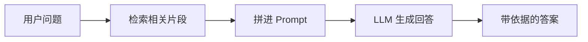
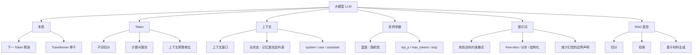

# 大模型

从 Token、上下文窗口、采样参数到提示词与 RAG 直觉，梳理调用大语言模型时最常用的基础概念。

<!-- more -->

## 1. 引言

大语言模型（Large Language Model, LLM）是在海量文本上预训练得到的神经网络，能够根据输入文本预测并生成后续内容。对应用开发者而言，不必先搞懂全部训练细节，优先掌握**怎么喂输入、怎么控输出、怎么接外部知识**即可。

本篇承接 [神经网络](/pages/ai-neural-network/)：现代 LLM 多以 Transformer 为骨干；下文聚焦 API 调用层面的共性概念。

---

## 2. 什么是 LLM

### 2.1 本质：下一词预测

LLM 在训练时学习的核心能力是：给定前文，预测下一个最可能出现的词（更准确地说是 Token）。对话、写作、摘要、写代码等能力，很大程度上是这一预测能力在不同提示下的涌现表现。

### 2.2 与「传统 NLP 模型」的差别（直觉）

| 维度 | 传统专用模型 | 大语言模型 |
|------|--------------|------------|
| **任务形态** | 多为分类、序列标注等固定任务 | 同一模型可服务多种自然语言任务 |
| **交互方式** | 特征工程 + 结构化输入 | 自然语言提示（Prompt）为主 |
| **知识来源** | 训练集 + 人工特征 | 预训练参数中的「压缩知识」+ 可选外部检索 |
| **使用重心** | 训练与调参 | 提示设计、工具调用、检索增强 |

---

## 3. Token

### 3.1 定义

Token 是模型处理文本的最小单位，通常是**子词（subword）**：既不是整词，也不是单个字符。英文常按词根/词缀切分，中文常按字或常见字组切分，具体取决于分词器（Tokenizer）。

示例直觉（非某一模型的精确切分）：

- `"hello"` → 可能是 1 个 Token
- `"ChatGPT"` → 可能是多个 Token
- `"人工智能"` → 可能是 2～4 个 Token

### 3.2 为什么重要

- **计费与限流**：多数 API 按输入 + 输出 Token 计费，并限制每分钟 Token 数。
- **上下文预算**：上下文窗口以 Token 计，不是「字符数」或「字数」。
- **效果差异**：同样一段中文，Token 数往往比英文「看起来更贵」——估算成本时要实测，不要按字符粗算。

### 3.3 实用习惯

- 长文档进模型前先摘要、切片，避免一次塞满窗口。
- 结构化输出（JSON）也会占用 Token，schema 别写得过长。
- 需要精确计数时，用官方 Tokenizer 或厂商提供的计数工具，不要自己按空格估。

---

## 4. 上下文（Context）

### 4.1 上下文窗口

上下文窗口（Context Window）是模型**单次请求能「看见」的 Token 上限**，通常包含：

- 系统提示（system）
- 历史对话
- 当前用户输入
- 模型即将生成的内容（输出也占窗口预算，具体规则因厂商而异）

超出窗口的内容会被截断或拒绝，模型无法「自动记住」窗口外的历史。

### 4.2 对话中的「记忆」从哪来

默认情况下，LLM **无状态**：每次请求只依赖你传入的消息列表。所谓「多轮记忆」，本质是客户端把历史消息再拼进上下文。

因此：

- 历史越长，成本越高，也越容易挤掉早期关键信息。
- 重要约束应放在 system 或每次请求的固定前缀里，而不是只说一次就指望模型永远记得。

### 4.3 常见消息角色

| 角色 | 典型用途 |
|------|----------|
| **system** | 人设、硬性规则、输出格式约束 |
| **user** | 当前任务与问题 |
| **assistant** | 历史回复；也可用于 few-shot 示范 |
| **tool / function** | 工具调用结果回填（在支持工具调用的接口中） |

---

## 5. 温度与其它采样参数

生成时，模型先得到各 Token 的概率分布，再按策略采样。常用旋钮如下。

### 5.1 温度（Temperature）

温度控制分布的「尖锐程度」：

- **偏低（如 0～0.3）**：更偏向高概率 Token，输出更稳、更可复现，适合分类、抽取、格式化、代码修补。
- **适中（如 0.5～0.8）**：平衡多样性与连贯性，适合一般对话与写作。
- **偏高（如 1.0+）**：更愿意抽低概率 Token，创意更强，但也更易跑偏、胡编。

直觉：温度不是「智商旋钮」，而是**随机性旋钮**。

### 5.2 相关参数（了解即可）

| 参数 | 作用（直觉） |
|------|----------------|
| **top_p**（核采样） | 只在累计概率达到 p 的候选里采样；与温度常二选一细调，不必同时猛拧 |
| **max_tokens** | 限制单次生成长度，防止跑飞与控成本 |
| **stop** | 遇到指定字符串提前结束，便于截断到某个边界 |
| **seed**（若支持） | 提高可复现性；即便如此，跨版本也不保证完全一致 |

应用建议：需要稳定结构化输出时，先把温度调低，再配合明确格式约束；不要指望高温 + 弱提示还能稳定产出合法 JSON。

---

## 6. 提示词（Prompt）

### 6.1 提示词在做什么

提示词是把任务、约束、上下文和期望格式写成模型能「接着写」的输入。好提示通常具备：

1. **角色与目标**：你是谁、要完成什么。
2. **输入材料**：需要处理的文本、数据、约束条件。
3. **输出规格**：格式、字段、长度、禁止事项。
4. **质量标准**：评判对错的规则，或正反例。

### 6.2 常用技巧

| 技巧 | 说明 |
|------|------|
| **指令清晰** | 用祈使句写清步骤；模糊词（「合适」「尽量好」）尽量换成可检查标准 |
| **Few-shot** | 给 1～3 个输入→输出示例，比长篇抽象说明更有效 |
| **分步推理** | 对复杂题要求先列要点再给结论，降低一步跳答案的错误率 |
| **结构化输出** | 约定 JSON / Markdown 表格等，便于程序解析 |
| **边界声明** | 明确「不知道就说不知道」「只依据给定材料」，减少幻觉 |

### 6.3 最小模板示例

```text
你是一名后端工程师助手。只根据「给定文档」回答，不要编造文档外事实。
若文档不足，请直接回复：信息不足。

【给定文档】
{docs}

【问题】
{question}

【输出格式】
- answer: 字符串
- citations: 字符串数组（引用文档中的原句）
```

---

## 7. RAG 直觉

### 7.1 为什么需要 RAG

模型参数里的知识有截止日期，且对私有业务数据（内部文档、工单、代码库）并不了解。把「相关材料检索出来，再塞进提示词让模型阅读回答」，就是检索增强生成（Retrieval-Augmented Generation, RAG）的基本思路。



### 7.2 三个环节（先建立直觉）

1. **切分（Chunking）**：长文档切成小段，便于检索与塞进窗口。
2. **检索（Retrieval）**：用关键词、向量相似度或混合检索，找出与问题最相关的若干段。
3. **生成（Generation）**：把检索结果作为上下文，要求模型**依据材料**作答，并尽量引用出处。

### 7.3 常见误区

- **检索差，生成再强也救不回来**：答错常常是「没检对」，不是「模型不够聪明」。
- **塞得越多越好**：无关段落会稀释注意力，还浪费 Token。
- **RAG ≠ 永久记忆**：它解决的是「本次回答有据可依」，不是自动建成完美知识库。

更完整的链、索引与评测，见 [大编排](/pages/ai-langchain/)；此处只需建立「先找材料、再让模型读」的直觉。

---

## 8. 调用时的实用清单

面向落地时，可按下面顺序自检：

1. **任务是否适合 LLM**：分类/抽取/改写/问答通常合适；强精确计算、强实时控制要配合工具或规则。
2. **Token 与窗口**：输入是否超限；历史是否该摘要或截断。
3. **采样参数**：要稳定就降温；要创意再升温。
4. **提示是否可检验**：有没有格式、边界、依据材料。
5. **知识是否过期/私有**：需要则上 RAG 或工具查询，而不是硬背进 Prompt。

---

## 9. 核心概念思维导图


