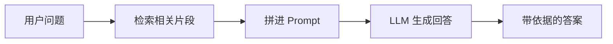
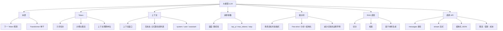

# 大模型
从 Token、上下文、采样参数到提示词与 RAG 直觉，并**亲手直调一次兼容 API**（messages / 流式 / 结构化输出），为后续Agent编排开发打底。

本篇对应 [学习路线](/pages/ai-roadmap/) 阶段 2。
<!-- more -->

## 1. 引言
大语言模型（Large Language Model, LLM）是在海量文本上预训练得到的深度神经网络，能够根据输入文本预测并续写后续内容。

> 面向应用开发者：不需要吃透预训练、微调底层训练细节，优先掌握**输入怎么构造、输出怎么控制、如何接入外部私有知识**。

本篇承接 [神经网络](/pages/ai-neural-network/)：主流 LLM 均以 Transformer 作为网络骨干。前半部分梳理核心理论概念；后半部分基于**OpenAI兼容 Chat Completions 接口**做实操演示，绝大多数公有云大模型、本地Ollama网关都提供该套兼容接口。

---

## 2. 什么是 LLM
### 2.1 本质：下一词预测
LLM预训练阶段的核心目标：给定上文序列，预测下一个概率最高的 Token。
对话、摘要、翻译、代码生成、逻辑推理等能力，都是该基础预测能力在合适提示下产生的**涌现能力**。

> ⚠️重要认知：模型不是真正“理解”语义，是统计概率续写，因此会产生**幻觉（编造不存在事实）**。

### 2.2 传统NLP模型 vs 大语言模型
| 维度 | 传统专用NLP模型 | 大语言模型 LLM |
|------|--------------|------------|
| **任务形态** | 针对单一任务训练，分类、序列标注 | 同一个模型支持多类自然语言任务 |
| **交互方式** | 人工特征工程 + 结构化输入 | 自然语言提示 Prompt 驱动 |
| **知识来源** | 训练数据集 + 人工特征 | 参数内压缩的预训练知识 + 外部检索增强 |
| **开发重心** | 数据集准备、模型训练调参 | 提示工程、RAG检索、工具调用、输出校验 |

---

## 3. Token
### 3.1 定义
Token是大模型处理文本的最小计算单元，采用**子词(subword)**切分，不等同汉字/英文单词。
- 英文：按词根、词缀切分；
- 中文：常按单字或者高频词组切分；
由配套分词器Tokenizer完成切分。

> 示例仅为直觉示意，非某模型真实切分结果
- `"hello"` → 1个Token
- `"ChatGPT"` → 多个Token
- `"人工智能"` → 2~4个Token

### 3.2 为什么开发必须关心Token
1. **计费&限流**：API大多按照输入Token + 输出Token统计计费，同时存在Token/分钟限流；
2. **上下文窗口上限**：窗口预算单位是Token，**不是字符、不是汉字个数**；
3. **语言差异**：同等长度中文消耗Token普遍高于英文，成本估算不能直接拿字符数换算。

### 3.3 工程实用习惯
- 长文档接入模型前，做切片、摘要压缩，避免占满上下文窗口；
- JSON Schema结构化描述同样消耗Token，不要写冗余庞大的schema；
- 精确统计Token，优先使用官方Tokenizer工具，禁止简单按空格、字数估算。

---

## 4. 上下文 Context
### 4.1 上下文窗口
上下文窗口代表单次API请求，模型能够读取的最大Token总数。
包含：
- system系统提示词
- 全部历史对话消息
- 当前用户query输入
- **待生成输出内容（多数厂商输出同样占用窗口配额）**

超过窗口上限，接口会截断前文或者直接报错；**模型无法主动记忆窗口之外任何内容**。

### 4.2 LLM本身是无状态服务
> API服务本身无记忆。对话的多轮记忆，完全由业务客户端把历史消息拼接进`messages`数组实现。

业务开发注意点：
- 对话轮次越多，消息列表越长，Token成本越高，还会挤压关键信息；
- 重要规则、约束不要只说一次依赖模型记忆，建议放在system或者每轮请求固定前缀；
- 长对话场景，需要实现历史摘要、旧消息丢弃策略。

### 4.3 messages消息角色
| 角色 | 用途说明 |
|------|----------|
| **system** | 设定模型人设、硬性业务规则、输出格式约束 |
| **user** | 用户问题、业务输入材料 |
| **assistant** | 模型历史回复；也用于Few‑shot示例示范 |
| **tool / function** | 工具调用返回结果回填，工具调用接口使用 |

---

## 5. 采样生成参数
模型得到候选Token概率分布，通过采样策略选择输出内容，下面是工程最常用配置。

### 5.1 temperature 温度
温度控制输出随机性，**不是智商调节旋钮**。
- `0 ~ 0.3` 低温度：优先高概率token，输出稳定可复现，适合信息抽取、分类、JSON结构化输出、代码生成；
- `0.5 ~ 0.8` 中等：兼顾连贯与多样性，普通对话、文案写作；
- `>1.0` 高温度：增强创意，更容易发散、出现幻觉编造内容。

### 5.2 配套采样参数
| 参数 | 作用说明 |
|------|--------|
| **top_p** 核采样 | 在累计概率top‑p集合内采样；一般和temperature二选一调优，不要同时大幅度修改 |
| **max_tokens** | 单次最大输出token，控制成本，防止无限输出 |
| **stop** | 停止词列表，匹配字符串立刻终止生成 |
| **seed** | 尝试固定随机种子提升复现，不同模型版本之间仍然无法保证100%一致 |

> 落地经验：想要稳定JSON输出，优先调低temperature，再配合格式约束；高温度下不要期待稳定结构化返回。

---

## 6. Prompt 提示词工程
### 6.1 提示词本质
把任务目标、约束条件、输入素材、输出规范，组织成模型可以续写的输入文本。高质量提示词一般包含四要素：
1. **角色与任务目标**：明确身份、需要完成什么任务
2. **输入原始材料**：文档、数据、业务条件
3. **输出规格约束**：格式、字段、长度、禁止行为
4. **评判标准/示例**：Few‑shot样例，明确边界“不知道如何回答就如实说明”，降低幻觉。

### 6.2 实用提示技巧
| 技巧 | 实践说明 |
|------|------|
| **指令明确** | 使用祈使句；把模糊描述替换成可检验标准 |
| **Few‑shot少样本** | 提供1‑3组输入输出示例，效果优于大段文字描述 |
| **思维分步推理** | 复杂问题，要求先输出思考要点，再给出最终答案，减少逻辑错误 |
| **强制结构化** | 指定JSON / Markdown表格，方便程序解析 |
| **幻觉防御声明** | 明确要求：仅依据提供材料作答，信息不足直接说明，禁止编造事实 |

### 6.3 RAG问答最小Prompt模板
```text
你是专业文档问答助手，**只允许依据【给定文档】内容回答，禁止编造文档以外信息**。
文档信息不足，直接回复：信息不足。

【给定文档】
{docs}

【用户问题】
{question}

【输出格式】
- answer: string，回答内容
- citations: string[]，引用原文片段
```

---

## 7. RAG 直觉
### 7.1 为什么需要 RAG
模型参数内的知识有截止日期，对私有业务数据（内部文档、工单、代码库）并不了解。把「相关材料检索出来，再塞进提示词让模型阅读回答」，就是检索增强生成（Retrieval-Augmented Generation, RAG）的基本思路。



### 7.2 三个环节（先建立直觉）
1. **切分（Chunking）**：长文档切成小段，便于检索与塞进窗口。
2. **检索（Retrieval）**：用关键词、向量相似度或混合检索，找出与问题最相关的若干段。
3. **生成（Generation）**：把检索结果作为上下文，要求模型**依据材料**作答，并尽量引用出处。

### 7.3 常见误区
- **检索差，生成再强也救不回来**：答错常常是「没检对」，不是「模型不够聪明」。
- **塞得越多越好**：无关段落会稀释注意力，还浪费 Token。
- **RAG ≠ 永久记忆**：它解决的是「本次回答有据可依」，不是自动建成完美知识库。

更完整的链、索引与评测，见 [大编排](/pages/ai-langchain/)；此处只需建立「先找材料、再让模型读」的直觉。

---

## 8. 直调 API（必做）
概念读完后，用任意 **OpenAI 兼容**端点亲手打通一轮。下面用伪环境变量，换成你的 Base URL、Key、模型名即可。

### 8.1 最小请求：messages
```bash
curl "$OPENAI_BASE_URL/v1/chat/completions" \
  -H "Authorization: Bearer $OPENAI_API_KEY" \
  -H "Content-Type: application/json" \
  -d '{
    "model": "你的模型名",
    "temperature": 0.2,
    "messages": [
      {"role": "system", "content": "你是简洁的助手。用中文回答。"},
      {"role": "user", "content": "用一句话解释什么是 Token。"}
    ]
  }'
```

关注响应里的：
- `choices[0].message.content`：助手正文
- `usage.prompt_tokens` / `completion_tokens`：对照前面「Token 与计费」的直觉

多轮时在客户端维护 `messages` 数组：把上一轮的 `assistant` 再塞回去，再追加新的 `user`。API **不替你记**历史。

### 8.2 流式（streaming）
设 `"stream": true`。响应变为 **SSE**：多行 `data: {...}`，最后常以 `data: [DONE]` 结束；每段增量多在 `choices[0].delta.content`。

适用：聊天 UI 边生成边展示、降低首字等待。注意：流式下完整 `usage` 有的厂商要额外参数才返回；超时与断线重连要自己处理。

### 8.3 结构化输出
落地常用「程序能解析的 JSON」，而不是散文。两条路（按厂商能力选）：

| 方式 | 做法 | 适用 |
|------|------|------|
| **提示约束** | system/user 里写清字段；温度调低；客户端 `JSON.parse`，失败则重试或纠错再调 | 各家都可用 |
| **JSON / schema 模式** | 若接口支持 `response_format: { "type": "json_object" }` 或 JSON Schema | 更稳，优先用 |

最小提示约束示例（与第 6 节模板同一思路）：
```text
只输出一个 JSON 对象，不要 Markdown 代码围栏，字段为：
{"answer": string, "confidence": number}
```

程序侧务必：**校验字段存在与类型**，不要假设模型永远合法。

### 8.4 排错与安全底线（旁路预热）
| 现象 | 先查什么 |
|------|----------|
| 401 / 403 | Key、权限、是否走对 Base URL |
| 429 | 限流：退避重试、降并发、缩短上下文 |
| 超时 / 空回复 | 网络、代理、`max_tokens`、流式解析是否吞掉数据 |
| JSON 解析失败 | 降温、收紧格式、改用官方 JSON 模式 |

密钥只放环境变量或密钥管理，**不要进仓库**；用户可控文本进 Prompt 时警惕提示注入（把不可信内容当「数据」包起来，并限制工具权限）。成本上优先控输入长度与 `max_tokens`，再谈换模型。

打通直调后，多步流水线、记忆与 RAG 工程化见 [大编排](/pages/ai-langchain/)。

---

## 9. 调用时的实用清单
面向落地时，可按下面顺序自检：

1. **任务是否适合 LLM**：分类/抽取/改写/问答通常合适；强精确计算、强实时控制要配合工具或规则。
2. **Token 与窗口**：输入是否超限；历史是否该摘要或截断。
3. **采样参数**：要稳定就降温；要创意再升温。
4. **提示是否可检验**：有没有格式、边界、依据材料；结构化输出是否可被程序校验。
5. **直调是否跑通**：非流式 → 流式 → JSON；能读懂 `usage` 与常见错误码。
6. **知识是否过期/私有**：需要则上 RAG 或工具查询，而不是硬背进 Prompt。

---

## 10. 核心概念思维导图

