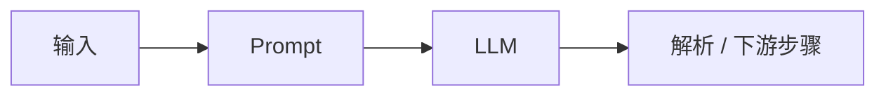
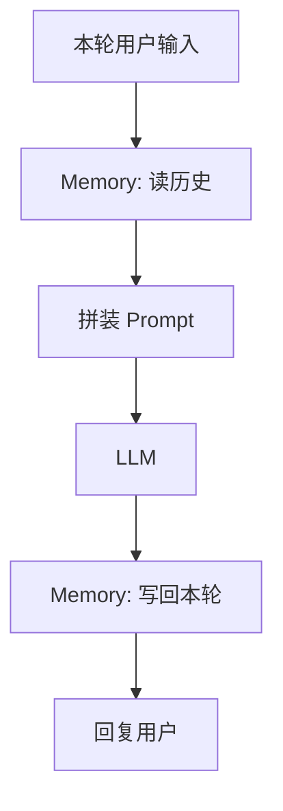
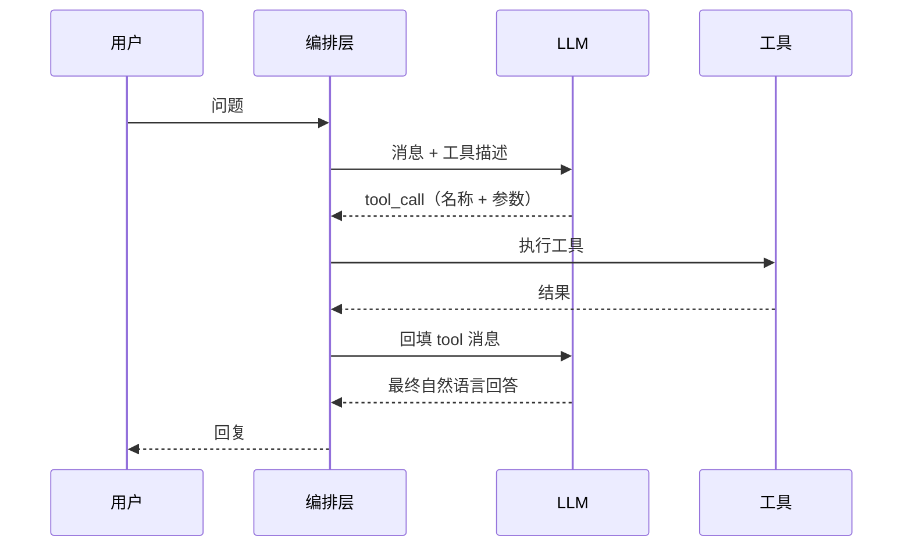
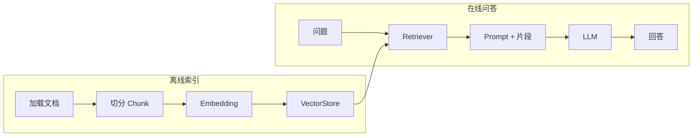

# 大编排

以 LangChain 为主线，梳理链（Chain）、记忆（Memory）、**单 Agent + 工具**与检索增强（RAG，含 Embedding / 向量库）——把单次 LLM 调用编排成可复用的应用流水线。

本篇对应 [学习路线](/pages/ai-roadmap/) 阶段 3。

<!-- more -->

## 1. 引言

上一篇 [大模型](/pages/ai-llm/) 解决的是「怎么和模型说话」：Token、上下文、温度、提示词、RAG 直觉，以及直调 API。进入落地后，常见需求会变成：

- 多步任务：先分类，再抽取，再生成回复
- 多轮对话：把历史塞回上下文，并控制长度与成本
- 外部能力：查库、搜文档、调 HTTP、跑代码
- 私有知识：检索业务材料，再让模型依据材料作答

**编排**就是把上述能力串成流水线。LangChain 是当前最常用的编排框架之一：用统一抽象对接多家模型，并把链、记忆、工具、检索组件拼在一起。本篇建立「能搭、能排错」的概念图。

**和后续章节的边界**（避免和路线阶段 4～6 打架）：

| 本篇（阶段 3） | 留给后面 |
|----------------|----------|
| 顺序/路由链、记忆、RAG 流水线 | **LangGraph**：复杂分支、循环、人机审批 |
| **单 Agent**（如 ReAct：动态选工具） | **多 Agent / Skill / 业务案例**（阶段 6） |
| LangChain 内置 Tools | **MCP**：标准工具/数据源协议（可与 LangGraph **并行**学） |

---

## 2. LangChain 在解决什么

### 2.1 一句话定位

LangChain = **模型调用 + 提示模板 + 输出解析 + 工具/检索插件** 的组合层。你写的是「数据怎么流过各步骤」，而不是每次手写 HTTP 与拼 Prompt。

### 2.2 核心积木（先认名）

| 积木 | 作用（直觉） |
|------|----------------|
| **Model / ChatModel** | 对接具体 LLM（OpenAI、本地开源等） |
| **PromptTemplate** | 把变量填进可复用提示词 |
| **OutputParser** | 把自由文本收成 JSON / 结构化对象 |
| **Chain / Runnable** | 把多步「可运行单元」串成管道 |
| **Memory** | 管理多轮历史如何写入下次请求 |
| **Tools** | 模型可调用的外部函数（搜索、数据库、API） |
| **Retrievers / VectorStore** | 检索相关文档片段，服务 RAG |

现代 LangChain 以 **LCEL（LangChain Expression Language）** 为主：用 `|` 把 Runnable 串起来，统一支持流式、批量、异步与中间结果追踪。

### 2.3 和「直接调 API」的差别

| 维度 | 直接调 API | 用 LangChain 编排 |
|------|------------|-------------------|
| **多步流程** | 自己写循环与分支 | Chain / Runnable 组合 |
| **换模型** | 改请求体与字段名 | 换 Model 实现，管道可复用 |
| **工具/RAG** | 自建协议与拼装 | 现成 Tools、Retriever 抽象 |
| **排错** | 自己打日志 | 可对接 LangSmith 等追踪 |

原则：小脚本可以直调 API；一旦出现「多步 + 工具 + 检索 + 要换模型」，编排层开始划算。

---

## 3. 链（Chain）

### 3.1 什么是链

链是「输入 → 若干变换 → 输出」的流水线。最简单的链往往是：

```text
用户输入 → Prompt 填充 → LLM 调用 →（可选）解析结构化结果
```

用 LCEL 的直觉写法：

```text
chain = prompt | model | parser
result = chain.invoke({"question": "……"})
```

### 3.2 常见链形态

| 形态 | 说明 | 典型场景 |
|------|------|----------|
| **单链** | 一步生成 | 摘要、改写、翻译 |
| **顺序链** | A 的输出喂给 B | 先提炼要点，再写对外邮件 |
| **路由链** | 先判断类型，再走不同子链 | 客服：退款 / 物流 / 其它 |
| **带检索的链** | 先 Retriever，再生成 | 文档问答（RAG） |
| **带工具的链 / Agent** | 模型决定是否调工具、调哪个 | 查库存后再回答 |



### 3.3 实用建议

- **一步能做完就不要硬拆成五步**：多一步就多一次延迟与失败点。
- **步骤边界要清晰**：每步输入输出字段写死（尤其 JSON），便于单测与替换。
- **可观测性优先**：关键链打上 run name / 元数据，出问题能定位是检索差还是生成差。

---

## 4. 记忆（Memory）

### 4.1 本质回顾

LLM 默认无状态。所谓「记住上次说过的话」，是你在**下一次请求**里再次带上历史消息。[大模型 · 上下文](/pages/ai-llm/) 已强调：记忆 = 消息列表管理，不是模型内部自动存档。

LangChain 的 Memory 抽象，就是帮你决定：

1. **存什么**（全文、摘要、还是关键槽位）
2. **何时写入**（每轮结束后）
3. **如何读出并拼进 Prompt**（system / history / 当前问题）

### 4.2 常见策略

| 策略 | 做法 | 优点 | 代价 |
|------|------|------|------|
| **缓冲窗口** | 只保留最近 K 轮 | 实现简单 | 早先约束易丢 |
| **全文历史** | 全部拼进上下文 | 信息全 | Token 暴涨、易超窗 |
| **摘要记忆** | 定期把旧对话压成摘要 | 控长度 | 摘要本身可能丢细节 |
| **实体 / 槽位** | 抽出用户名、订单号等结构化字段 | 关键信息不丢 | 要设计抽取逻辑 |
| **外部存储** | Redis / DB 按 session_id 存 | 多实例可共享 | 多一层基建 |

### 4.3 落地注意

- **重要规则放 system 或每轮固定前缀**，不要只依赖「很久以前说过一次」。
- **敏感信息**：历史落盘要脱敏与权限控制；会话结束可清理。
- **与 RAG 分工**：长期业务知识进知识库检索；短期对话状态用 Memory。两者不要混成一团「全都塞 Prompt」。



---

## 5. 工具调用（Tool Calling）

### 5.1 为什么需要工具

模型擅长语言与推理，但不擅长：

- 实时数据（股价、库存、工单状态）
- 精确计算与事务操作（下单、改库）
- 访问私有系统（需鉴权的 API）

工具调用让模型在对话中**生成结构化「函数调用」请求**，由你的运行时真正执行，再把结果回填，模型据此继续回答。



### 5.2 在 LangChain 里怎么看

典型闭环：

1. 用普通函数或 API 封装成 **Tool**（名称、描述、参数 schema）
2. 绑定到支持 tool calling 的 ChatModel（`bind_tools` 一类接口）
3. 模型返回 tool calls → 执行 → 结果作为 `tool` 角色消息再调模型
4. 直到模型给出不再调用工具的最终答复

若模型需**自主决定**调用顺序与是否继续，就进入 **单 Agent** 形态（ReAct 等）。简单固定流程（永远先查库再回答）用普通链即可，不必上 Agent。

多 Agent 分工、Skill 封装与端到端案例留给路线阶段 6；本篇把「一个 Agent + 若干 Tools」跑通即可。

### 5.3 设计工具的要点

| 要点 | 说明 |
|------|------|
| **描述写给人看也写给模型看** | 名称与 description 决定模型何时选用；含糊描述 = 乱调工具 |
| **参数用严格 schema** | 类型、必填、枚举；降低胡编参数 |
| **工具要幂等或可安全重试** | 网络抖动时编排层可能重试 |
| **权限在运行时校验** | 不要相信模型「自己说有权限」 |
| **返回给模型的内容要短而结构化** | 大段日志会污染上下文；返回关键字段即可 |

---

## 6. 检索增强（RAG）在编排中的位置

### 6.1 从直觉到流水线

[大模型 · RAG 直觉](/pages/ai-llm/) 已给出「先检索、再生成」。在 LangChain 中，这条路径通常落成：

```text
文档加载 → 切分 → 向量化 → 写入 VectorStore
                ↑ 离线 / 定时
用户问题 → 检索 Top-K 片段 → 填入 Prompt → LLM → 答案（可带引用）
```



### 6.2 Embedding 与向量库（本阶段要点）

RAG 工程里最常卡的两块：

| 概念 | 直觉 |
|------|------|
| **Embedding** | 把文本压成向量，语义相近则向量相近 |
| **VectorStore** | 存向量并按相似度取 Top-K（FAISS、Chroma、云检索等） |

切分策略（长度、重叠、按标题）会直接改变「检得回什么」。先固定一套切分与 Embedding 模型，用小评测集对比，再换更大 LLM。

### 6.3 LangChain 中的关键组件

| 组件 | 职责 |
|------|------|
| **Document Loader** | 从 PDF、网页、Notion、数据库等拉原文 |
| **Text Splitter** | 按长度/标题/语义切 Chunk，可设重叠 |
| **Embeddings** | 把文本变成向量 |
| **VectorStore** | 存向量并做相似度检索（FAISS、Chroma、云检索等） |
| **Retriever** | 统一「给定 query → 返回 Documents」的接口 |
| **RAG Chain** | 检索 + 提示 + 生成的组合链 |

### 6.4 效果往往死在检索，而不是模型

排错顺序建议：

1. **检回的 Chunk 是否相关？** 不相关 → 调切分、改 Embedding、加关键词/混合检索、做 query 改写。
2. **相关但答案仍错？** → 提示约束（只依据材料、不知则说不知）、降温度、要求引用原文。
3. **偶尔好偶尔坏？** → 固定评测集（问题 + 期望依据文档），对比改动，避免凭感觉调参。

与 Memory 的边界再次强调：RAG 解决「知识从哪来」；Memory 解决「这轮对话状态」；工具解决「实时动作与精确查询」。

---

## 7. 最小心智模型：一次请求里有什么

把编排跑通时，脑子里应能画出单次调用的组成：

| 部分 | 来源 |
|------|------|
| 系统规则 | 固定 Prompt / system |
| 对话历史 | Memory |
| 检索片段 | Retriever（RAG） |
| 工具结果 | Tool 执行回填 |
| 当前用户话 | 本轮输入 |

上下文窗口是稀缺预算：四类内容互相挤占。编排的核心工程问题，经常是**在有限 Token 里排优先级**，而不是再多接一个模型。

---

## 8. 实用清单

动手做一个「内部文档问答」或「带查询工具的助手」时，可按此自检：

1. **用链还是单 Agent**：流程固定 → Chain；需动态选工具与多步探索 → 单 Agent（并接受更难测、更贵）。
2. **Memory 策略是否匹配会话长度**：短客服用窗口；长咨询考虑摘要或槽位。
3. **工具描述与权限是否合格**：schema 清晰，执行侧鉴权；密钥不进仓库。
4. **RAG 是否先验证检索**：先看 Top-K 原文与 Embedding/切分，再谈换更大模型。
5. **可观测与旁路**：至少能区分失败发生在检索、工具还是生成；记下 Token 用量与限流；用户输入当数据防提示注入。
6. **下一步（可并行）**：
   - 控制流复杂（循环、分支、人工审批）→ **LangGraph**
   - 要把工具/数据源标准化接入 → **MCP**
   - 多角色协作与可复用 Skill、端到端上线 → 路线阶段 6

---

## 9. 核心概念思维导图

```mermaid
graph TD
  A["大编排 · LangChain"] --> B[定位]
  B --> B1["组合模型 / 提示 / 解析 / 插件"]
  B --> B2["LCEL: Runnable 管道"]

  A --> C[链 Chain]
  C --> C1["Prompt -> Model -> Parser"]
  C --> C2["顺序 / 路由 / RAG / 工具链"]

  A --> D[记忆 Memory]
  D --> D1["本质: 拼历史进上下文"]
  D --> D2["窗口 / 摘要 / 槽位 / 外存"]

  A --> E[工具与单 Agent]
  E --> E1["模型选型 + 参数 schema"]
  E --> E2[执行回填再生成]
  E --> E3["固定链 vs 单 Agent"]

  A --> F[RAG 编排]
  F --> F1["切分 · Embedding · 向量库"]
  F --> F2["Retriever -> Prompt -> LLM"]
  F --> F3["先检对, 再调生成"]

  A --> G[工程要点]
  G --> G1[Token 预算与优先级]
  G --> G2[可观测 · 评测 · 成本安全]
  G --> G3["复杂控制流 -> LangGraph"]
  G --> G4["标准工具协议 -> MCP"]
```


